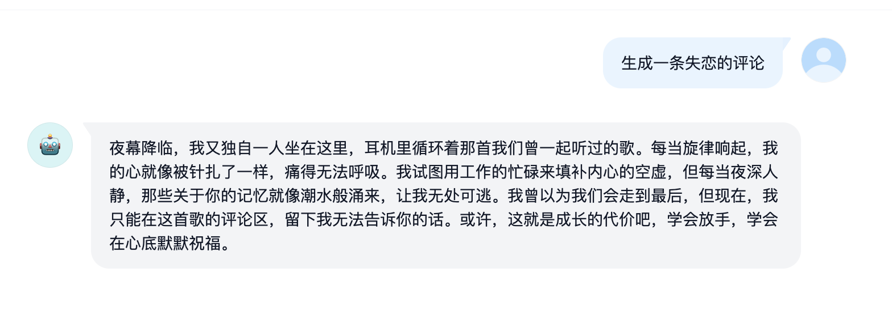
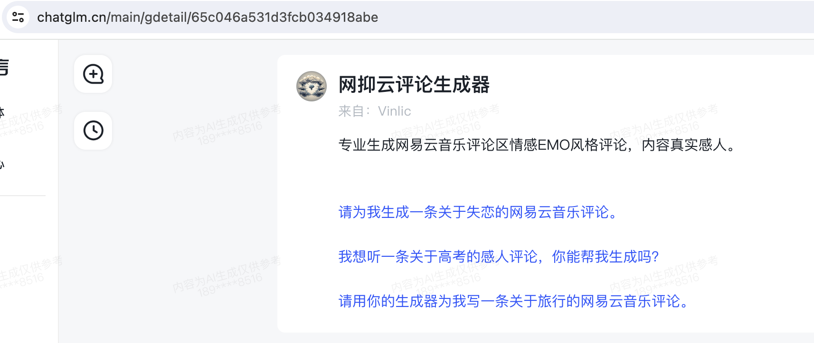

# GLM AI Free 服务


支持高速流式输出、支持多轮对话、支持智能体对话、支持AI绘图、支持联网搜索、支持长文档解读、支持图像解析，零配置部署，多路token支持，自动清理会话痕迹。

与ChatGPT接口完全兼容。

还有以下四个free-api欢迎关注：

Moonshot AI（Kimi.ai）接口转API [kimi-free-api](https://github.com/LLM-Red-Team/kimi-free-api)

阶跃星辰 (跃问StepChat) 接口转API [step-free-api](https://github.com/LLM-Red-Team/step-free-api)

阿里通义 (Qwen) 接口转API [qwen-free-api](https://github.com/LLM-Red-Team/qwen-free-api)

秘塔AI (metaso) 接口转API [metaso-free-api](https://github.com/LLM-Red-Team/metaso-free-api)

聆心智能 (Emohaa) 接口转API [emohaa-free-api](https://github.com/LLM-Red-Team/emohaa-free-api)

## 声明

仅限自用，禁止对外提供服务或商用，避免对官方造成服务压力，否则风险自担！

仅限自用，禁止对外提供服务或商用，避免对官方造成服务压力，否则风险自担！

仅限自用，禁止对外提供服务或商用，避免对官方造成服务压力，否则风险自担！

## 目录

* [声明](#声明)
* [在线体验](#在线体验)
* [效果示例](#效果示例)
* [接入准备](#接入准备)
  * [智能体接入](#智能体接入)
  * [多账号接入](#多账号接入)
* [Docker部署](#Docker部署)
  * [Docker-compose部署](#Docker-compose部署)
* [Render部署](#Render部署)
* [Vercel部署](#Vercel部署)
* [原生部署](#原生部署)
* [接口列表](#接口列表)
  * [对话补全](#对话补全)
  * [AI绘图](#AI绘图)
  * [文档解读](#文档解读)
  * [图像解析](#图像解析)
  * [refresh_token存活检测](#refresh_token存活检测)
* [注意事项](#注意事项)
  * [Nginx反代优化](#Nginx反代优化)

## 声明

仅限自用，禁止对外提供服务或商用，避免对官方造成服务压力，否则风险自担！

仅限自用，禁止对外提供服务或商用，避免对官方造成服务压力，否则风险自担！

仅限自用，禁止对外提供服务或商用，避免对官方造成服务压力，否则风险自担！

## 在线体验

此链接仅临时测试功能，只有一路并发，如果遇到异常请稍后重试，建议自行部署使用。

https://udify.app/chat/Pe89TtaX3rKXM8NS

## 测试接口

此接口实例部署在[Render](#Render部署)上面，遇到容器回收可能导致响应速度较慢，仅供测试，建议自行部署。

https://glm-free-api-ij4o.onrender.com

## 效果示例

### 验明正身Demo


### 智能体对话Demo

对应智能体链接：[网抑云评论生成器](https://chatglm.cn/main/gdetail/65c046a531d3fcb034918abe)



### 多轮对话Demo


### AI绘图Demo


### 联网搜索Demo


### 长文档解读Demo


### 代码调用Demo


### 图像解析Demo


## 接入准备

从 [智谱清言](https://chatglm.cn/) 获取refresh_token

进入智谱清言随便发起一个对话，然后F12打开开发者工具，从Application > Cookies中找到`chatglm_refresh_token`的值，这将作为Authorization的Bearer Token值：`Authorization: Bearer TOKEN`


### 智能体接入

打开智能体的聊天界面，地址栏的一串ID就是智能体的ID，复制下来备用，这个值将用作调用时的 `model` 参数值。



### 多账号接入

目前似乎限制同个账号同时只能有*一路*输出，你可以通过提供多个账号的chatglm_refresh_token并使用`,`拼接提供：

`Authorization: Bearer TOKEN1,TOKEN2,TOKEN3`

每次请求服务会从中挑选一个。

## Docker部署

请准备一台具有公网IP的服务器并将8000端口开放。

拉取镜像并启动服务

```shell
docker run -it -d --init --name glm-free-api -p 8000:8000 -e TZ=Asia/Shanghai vinlic/glm-free-api:latest
```

查看服务实时日志

```shell
docker logs -f glm-free-api
```

重启服务

```shell
docker restart glm-free-api
```

停止服务

```shell
docker stop glm-free-api
```

### Docker-compose部署

```yaml
version: '3'

services:
  glm-free-api:
    container_name: glm-free-api
    image: vinlic/glm-free-api:latest
    restart: always
    ports:
      - "8000:8000"
    environment:
      - TZ=Asia/Shanghai
```

### Render部署

**注意：部分部署区域可能无法连接glm，如容器日志出现请求超时或无法连接，请切换其他区域部署！**
**注意：免费账户的容器实例将在一段时间不活动时自动停止运行，这会导致下次请求时遇到50秒或更长的延迟，建议查看[Render容器保活](https://github.com/LLM-Red-Team/free-api-hub/#Render%E5%AE%B9%E5%99%A8%E4%BF%9D%E6%B4%BB)**

1. fork本项目到你的github账号下。

2. 访问 [Render](https://dashboard.render.com/) 并登录你的github账号。

3. 构建你的 Web Service（New+ -> Build and deploy from a Git repository -> Connect你fork的项目 -> 选择部署区域 -> 选择实例类型为Free -> Create Web Service）。

4. 等待构建完成后，复制分配的域名并拼接URL访问即可。

### Vercel部署

**注意：Vercel免费账户的请求响应超时时间为10秒，但接口响应通常较久，可能会遇到Vercel返回的504超时错误！**

请先确保安装了Node.js环境。

```shell
npm i -g vercel --registry http://registry.npmmirror.com
vercel login
git clone https://github.com/LLM-Red-Team/glm-free-api
cd glm-free-api
vercel --prod
```

## 原生部署

请准备一台具有公网IP的服务器并将8000端口开放。

请先安装好Node.js环境并且配置好环境变量，确认node命令可用。

安装依赖

```shell
npm i
```

安装PM2进行进程守护

```shell
npm i -g pm2
```

编译构建，看到dist目录就是构建完成

```shell
npm run build
```

启动服务

```shell
pm2 start dist/index.js --name "glm-free-api"
```

查看服务实时日志

```shell
pm2 logs glm-free-api
```

重启服务

```shell
pm2 reload glm-free-api
```

停止服务

```shell
pm2 stop glm-free-api
```

## 接口列表

目前支持与openai兼容的 `/v1/chat/completions` 接口，可自行使用与openai或其他兼容的客户端接入接口，或者使用 [dify](https://dify.ai/) 等线上服务接入使用。

### 对话补全

对话补全接口，与openai的 [chat-completions-api](https://platform.openai.com/docs/guides/text-generation/chat-completions-api) 兼容。

**POST /v1/chat/completions**

header 需要设置 Authorization 头部：

```
Authorization: Bearer [refresh_token]
```

请求数据：
```json
{
    // 如果使用智能体请填写智能体ID到此处，否则可以乱填
    "model": "glm4",
    "messages": [
        {
            "role": "user",
            "content": "你叫什么？"
        }
    ],
    // 如果使用SSE流请设置为true，默认false
    "stream": false
}
```

响应数据：
```json
{
    "id": "65f6c28546bae1f0fbb532de",
    "model": "glm4",
    "object": "chat.completion",
    "choices": [
        {
            "index": 0,
            "message": {
                "role": "assistant",
                "content": "我叫智谱清言，是基于智谱 AI 公司于 2023 年训练的 ChatGLM 开发的。我的任务是针对用户的问题和要求提供适当的答复和支持。"
            },
            "finish_reason": "stop"
        }
    ],
    "usage": {
        "prompt_tokens": 1,
        "completion_tokens": 1,
        "total_tokens": 2
    },
    "created": 1710152062
}
```

### AI绘图

对话补全接口，与openai的 [images-create-api](https://platform.openai.com/docs/api-reference/images/create) 兼容。

**POST /v1/images/generations**

header 需要设置 Authorization 头部：

```
Authorization: Bearer [refresh_token]
```

请求数据：
```json
{
    // 如果使用智能体请填写智能体ID到此处，否则可以乱填
    "model": "cogview-3",
    "prompt": "一只可爱的猫"
}
```

响应数据：
```json
{
    "created": 1711507449,
    "data": [
        {
            "url": "https://sfile.chatglm.cn/testpath/5e56234b-34ae-593c-ba4e-3f7ba77b5768_0.png"
        }
    ]
}
```

### 文档解读

提供一个可访问的文件URL或者BASE64_URL进行解析。

**POST /v1/chat/completions**

header 需要设置 Authorization 头部：

```
Authorization: Bearer [refresh_token]
```

请求数据：
```json
{
    // 如果使用智能体请填写智能体ID到此处，否则可以乱填
    "model": "glm4",
    "messages": [
        {
            "role": "user",
            "content": [
                {
                    "type": "file",
                    "file_url": {
                        "url": "https://mj101-1317487292.cos.ap-shanghai.myqcloud.com/ai/test.pdf"
                    }
                },
                {
                    "type": "text",
                    "text": "文档里说了什么？"
                }
            ]
        }
    ],
    // 如果使用SSE流请设置为true，默认false
    "stream": false
}
```

响应数据：
```json
{
    "id": "cnmuo7mcp7f9hjcmihn0",
    "model": "glm4",
    "object": "chat.completion",
    "choices": [
        {
            "index": 0,
            "message": {
                "role": "assistant",
                "content": "根据文档内容，我总结如下：\n\n这是一份关于希腊罗马时期的魔法咒语和仪式的文本，包含几个魔法仪式：\n\n1. 一个涉及面包、仪式场所和特定咒语的仪式，用于使某人爱上你。\n\n2. 一个针对女神赫卡忒的召唤仪式，用来折磨某人直到她自愿来到你身边。\n\n3. 一个通过念诵爱神阿芙罗狄蒂的秘密名字，连续七天进行仪式，来赢得一个美丽女子的心。\n\n4. 一个通过燃烧没药并念诵咒语，让一个女子对你产生强烈欲望的仪式。\n\n这些仪式都带有魔法和迷信色彩，使用各种咒语和象征性行为来影响人的感情和意愿。"
            },
            "finish_reason": "stop"
        }
    ],
    "usage": {
        "prompt_tokens": 1,
        "completion_tokens": 1,
        "total_tokens": 2
    },
    "created": 100920
}
```

### 图像解析

提供一个可访问的图像URL或者BASE64_URL进行解析。

此格式兼容 [gpt-4-vision-preview](https://platform.openai.com/docs/guides/vision) API格式，您也可以用这个格式传送文档进行解析。

**POST /v1/chat/completions**

header 需要设置 Authorization 头部：

```
Authorization: Bearer [refresh_token]
```

请求数据：
```json
{
    "model": "65c046a531d3fcb034918abe",
    "messages": [
        {
            "role": "user",
            "content": [
                {
                    "type": "image_url",
                    "image_url": {
                        "url": "http://1255881664.vod2.myqcloud.com/6a0cd388vodbj1255881664/7b97ce1d3270835009240537095/uSfDwh6ZpB0A.png"
                    }
                },
                {
                    "type": "text",
                    "text": "图像描述了什么？"
                }
            ]
        }
    ],
    "stream": false
}
```

响应数据：
```json
{
    "id": "65f6c28546bae1f0fbb532de",
    "model": "glm",
    "object": "chat.completion",
    "choices": [
        {
            "index": 0,
            "message": {
                "role": "assistant",
                "content": "图片中展示的是一个蓝色背景下的logo，具体地，左边是一个由多个蓝色的圆点组成的圆形图案，右边是“智谱·AI”四个字，字体颜色为蓝色。"
            },
            "finish_reason": "stop"
        }
    ],
    "usage": {
        "prompt_tokens": 1,
        "completion_tokens": 1,
        "total_tokens": 2
    },
    "created": 1710670469
}
```

### refresh_token存活检测

检测refresh_token是否存活，如果存活live未true，否则为false，请不要频繁（小于10分钟）调用此接口。

**POST /token/check**

请求数据：
```json
{
    "token": "eyJhbGciOiJIUzUxMiIsInR5cCI6IkpXVCJ9..."
}
```

响应数据：
```json
{
    "live": true
}
```

## 注意事项

### Nginx反代优化

如果您正在使用Nginx反向代理glm-free-api，请添加以下配置项优化流的输出效果，优化体验感。

```nginx
# 关闭代理缓冲。当设置为off时，Nginx会立即将客户端请求发送到后端服务器，并立即将从后端服务器接收到的响应发送回客户端。
proxy_buffering off;
# 启用分块传输编码。分块传输编码允许服务器为动态生成的内容分块发送数据，而不需要预先知道内容的大小。
chunked_transfer_encoding on;
# 开启TCP_NOPUSH，这告诉Nginx在数据包发送到客户端之前，尽可能地发送数据。这通常在sendfile使用时配合使用，可以提高网络效率。
tcp_nopush on;
# 开启TCP_NODELAY，这告诉Nginx不延迟发送数据，立即发送小数据包。在某些情况下，这可以减少网络的延迟。
tcp_nodelay on;
# 设置保持连接的超时时间，这里设置为120秒。如果在这段时间内，客户端和服务器之间没有进一步的通信，连接将被关闭。
keepalive_timeout 120;
```

### Token统计

由于推理侧不在glm-free-api，因此token不可统计，将以固定数字返回。

## Star History

[](https://star-history.com/#LLM-Red-Team/glm-free-api&Date)
